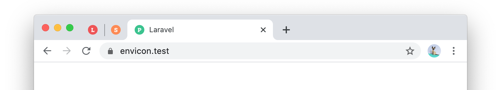

# Laravel Envicon

<p align="center">
    

<p align="center">
<a href="https://packagist.org/packages/hedger/laravel-envicon"></a>
<a href="LICENSE.md"></a>
<a href="https://github.com/nhedger/laravel-envicon/actions?query=workflow%3ATest"></a>
</p>

This packages allows you to display a custom favicon depending on your
runtime environment. This makes it easy to identify immediately on which
environment you're browsing.

## Install

Via [Composer](https://getcomposer.org/)

```shell script
composer require hedger/laravel-envicon
```

Once the package is installed, you'll need to **publish the configuration**
to link your environments to custom favicons.

```shell script
php artisan vendor:publish --tag=envicon-config
```

If you want to use the default envicons provided by this package, run
the following command that will copy them in your `public/favicons`
folder.

```shell script
php artisan vendor:publish --tag=envicon-favicons
```

## Usage

Simply use the provided helper in place of your favicon's URL. This will
return the favicon that matches your current **runtime environment**.

```blade
<!doctype html>
<html lang="en">
    <head>
        <link rel="icon" href="{{ Envicon::url() }}">
    </head>
</html>
```

If you need the URL of a favicon for a **specific environment**, use the
following statement instead. You'll need to pass the environment's name
as the first parameter.

```blade
<!doctype html>
<html lang="en">
    <head>
        <link rel="icon" href="{{ Envicon::for('production') }}">
    </head>
</html>
```

## Testing
Tests can be run using the following composer script.
```shell script
composer test
```

## License
The MIT License (MIT). Please see [License File](LICENSE.md) for more information.

[ico-version]: https://img.shields.io/packagist/v/hedger/laravel-envicon.svg?style=flat-square
[ico-license]: https://img.shields.io/badge/license-MIT-brightgreen.svg?style=flat-square
[ico-build]: https://img.shields.io/github/workflow/status/nhedger/laravel-envicon/Test/master?style=flat-square
[screenshot]: .github/screenshot.png

[link-packagist]: https://packagist.org/packages/hedger/laravel-envicon

